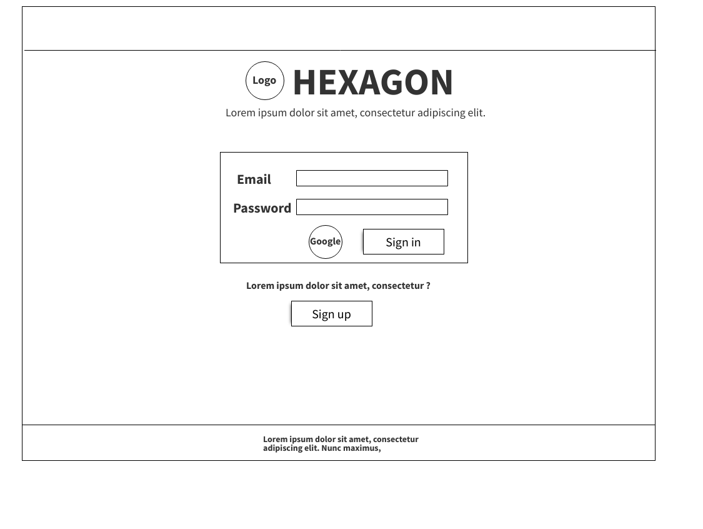
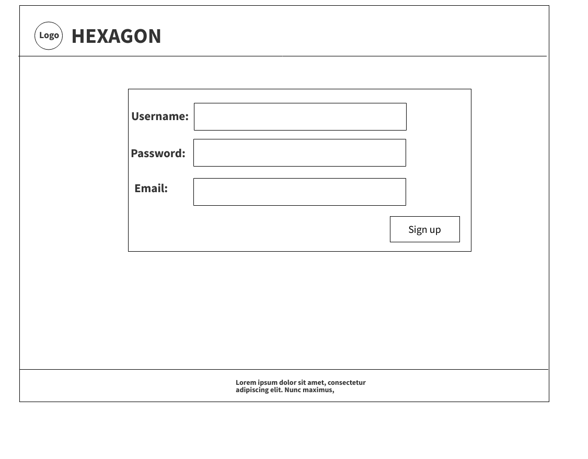
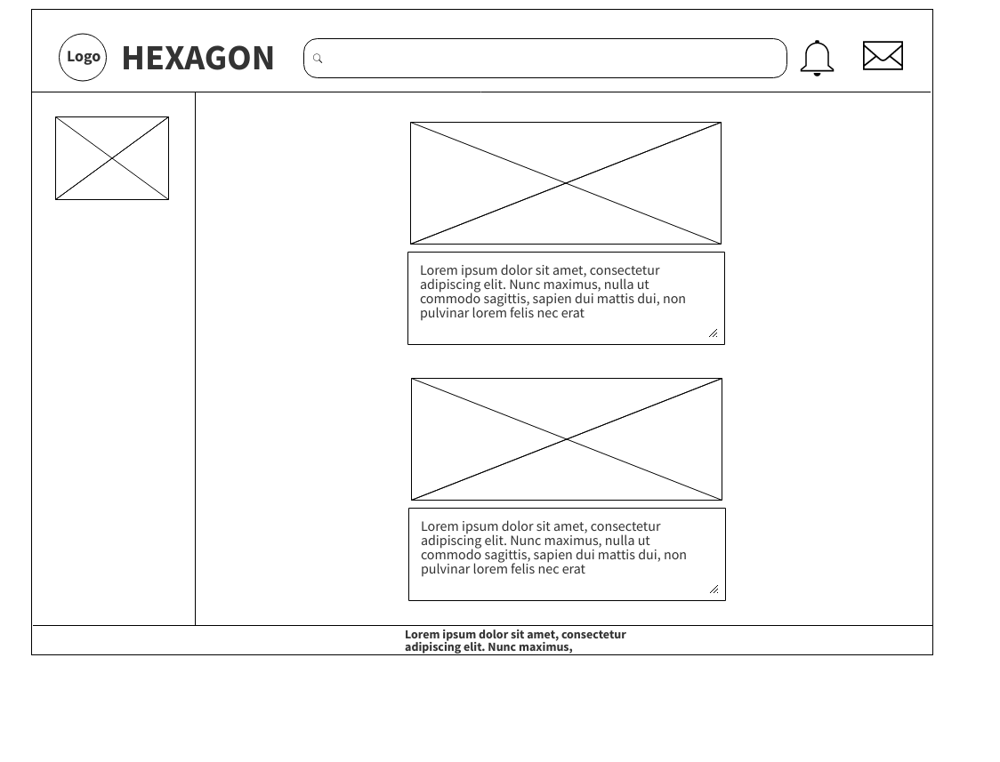
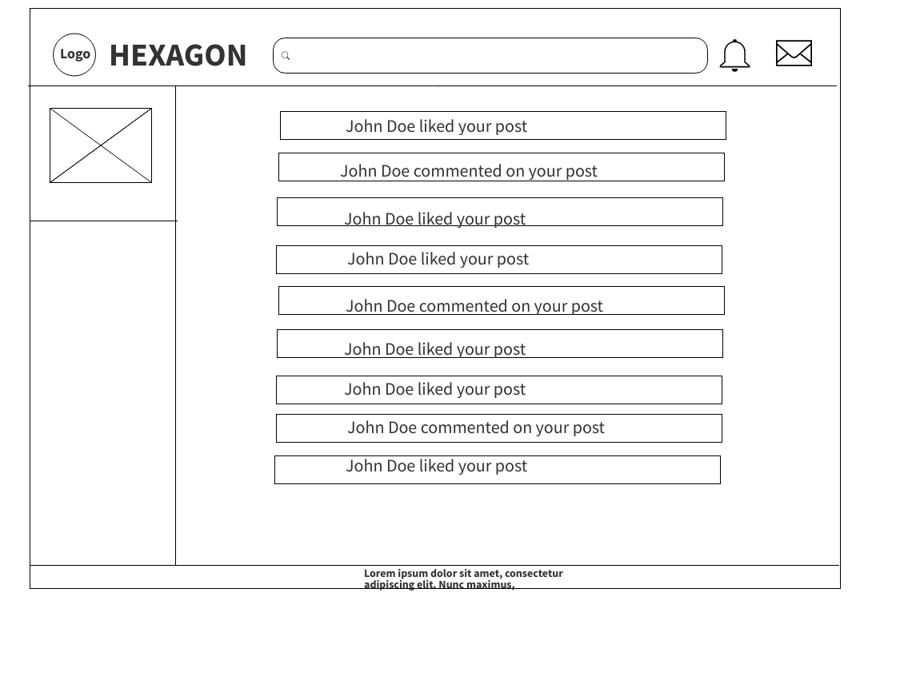
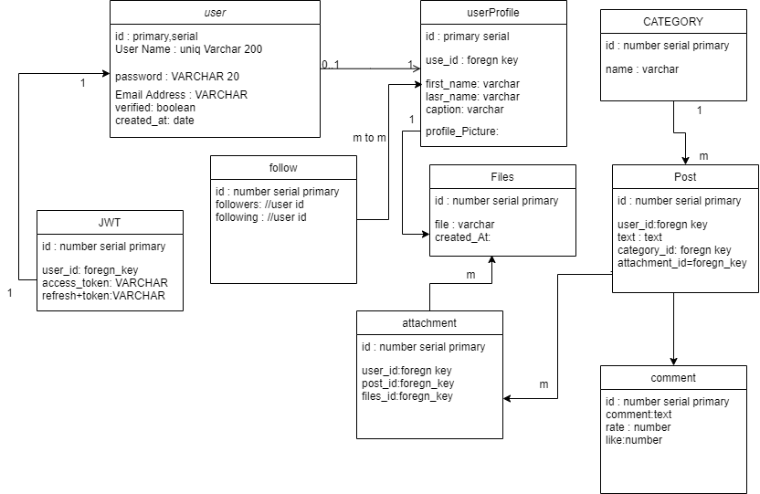
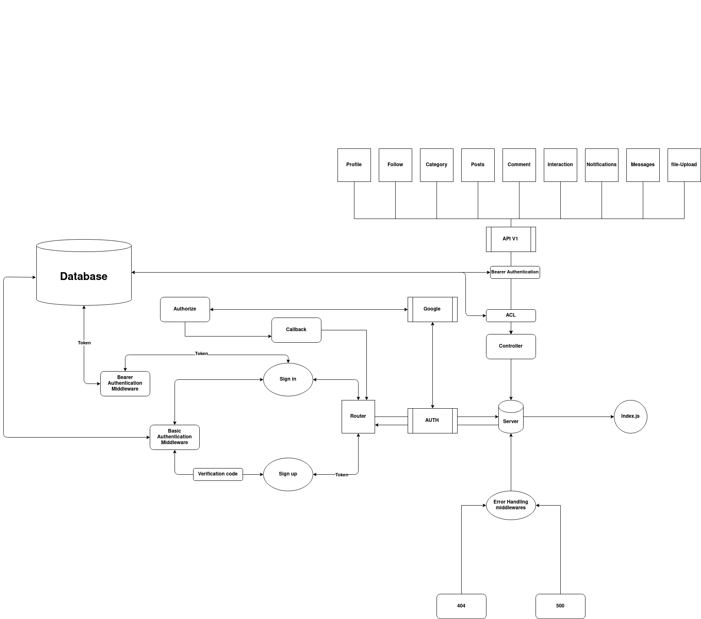

# Hexagon

## Authors

1. Wesam Al-Masri.
2. Anwar Abbass.
3. Emran Aloul.
4. Amjad Mesmar.

## About

A social network website that allows creative individuals to share their own creative works, starting from paintings to even sculpturing and photography.

## Problem domain

1. Creative individuals find difficulty in finding a good platform for them to display their work and to reach their audience. Most social media websites and platforms don’t focus on a specific group of people and may not provide what they need to thrive.

2. Individuals who are interested in creativity and creative activities such as art, sculpture and photography can't find a platform that allows them to find creative works and get the most experience from it.

- The solution? ***Hexagon!!***

Hexagon is a social media for creative people such as artists, that will allow them to share their work with the users who are interested in art in general. Hexagon will increase the chance for creative users to grow their audience and fanbase, arrange or attend events related to what they love.

## User stories

1. As a user, I should be able to create posts.

2. As a user, I should be able to edit my own posts.

3. As a user, I should be able to delete my own posts

4. As a user, I should be able to comment on my own and others' posts.

5. As a user, I should be able to follow other users.

6. As a user, I should be able to like others' posts.

----------------------------------------------------------------------------------------------------

## Wireframes

### Home page

### Sign up page

### Verification page

### Main page

### Profile page

### Search profiles page

### Post page

### Messages page

### Notifications page

----------------------------------------------------------------------------------------------------

## Domain Modeling

## Uml Diagram

----------------------------------------------------------------------------------------------------

## End Points

### Auth

| Method | Endpint                     | Description                                           |
| ------ | --------------------------- | ----------------------------------------------------- |
| POST   | `/auth/signup`              | Create a new user                                     |
| POST   | `/auth/signuin`             | Login in with certain user using basic authentication |
| GET    | `/auth/logout`              | Logout User                                           |
| POST   | `/auth/refresh`             | Get new access token                                  |
| PUT    | `/auth/user/password`       | Update user password                                  |
| PUT    | `/auth/user/password/code`  | Require code to reset the password                    |
| POST   | `/auth/user/password/reset` | Verify the code and reset the password                |
| PUT    | `/auth/user/password`       | Update user password                                  |
| POST   | `/auth/user/verify`         | Verify user account                                   |
| GET    | `/auth/google`              | Sign in/up with google                                |

### User Profile

| Method | Endpint                     | Description                                                                 |
| ------ | --------------------------- | --------------------------------------------------------------------------- |
| GET    | `/me-profile`               | Get profile information for logged in user                                  |
| GET    | `/me-profile/with-messages` | Get profiles information that the logged in user has previous messages with |
| GET    | `/profile`                  | Get all users' profiles information                                         |
| GET    | `/profile/:username`        | Get user' profiles' information by username                                 |
| POST   | `/profile`                  | Create user's profile                                                       |
| PUT    | `/profile`                  | Update user' profiles information                                           |

### Follow

| Method | Endpint   | Description           |
| ------ | --------- | --------------------- |
| POST   | `/follow` | Follow/Unfollow  user |

### File

| Method | Endpint        | Description |
| ------ | -------------- | ----------- |
| POST   | `/file-upload` | Upload file |

### Category

| Method | Endpint     | Description         |
| ------ | ----------- | ------------------- |
| Get    | `/category` | Get categories list |

### POST

| Method | Endpint             | Description                               |
| ------ | ------------------- | ----------------------------------------- |
| Get    | `/posts/timeline`   | Get all posts timeline for logged in user |
| Get    | `/posts/profile/id` | Get all posts for a profile by profile id |
| Get    | `/posts/category`   | Get all posts information on category     |
| Get    | `/posts/post/:id`   | Get post information  by id               |
| POST   | `/posts/post`       | Create post                               |
| PUT    | `/posts/post/:id`   | Update post                               |
| DELETE | `/posts/post/:id`   | Delete post                               |

### Comment

| Method | Endpint            | Description                                    |
| ------ | ------------------ | ---------------------------------------------- |
| Get    | `/comment/:postId` | Get all comments information for specific post |
| POST   | `/comment`         | Create comment                                 |
| PUT    | `/comment/:id`     | Update comment                                 |
| DELETE | `/comment/:id`     | Delete *comment                                |

### Notifications

| Method | Endpint          | Description                                           |
| ------ | ---------------- | ----------------------------------------------------- |
| Get    | `/Notifications` | Get all Notifications information for logged in user |
| PUT    | `/Notifications` | Update notifications (change to seen)                 |

### Messages

| Method | Endpint         | Description                                      |
| ------ | --------------- | ------------------------------------------------ |
| Get    | `/Messages`     | Get all Messages information for logged in user |
| DELETE | `/Messages/:id` | Delete Messages (change to seen)                 |
| PUT    | `/Messages/:id` | Update Messages (change to seen)                 |

### Interaction

| Method | Endpint        | Description                  |
| ------ | -------------- | ---------------------------- |
| Get    | `/interaction` | Get all interaction          |
| post   | `/interaction` | Delete or INSERT interaction |

#### Resources

- [Deployed Web App](https://hexagon-sm.herokuapp.com/)
- [Repository](https://github.com/ultimate-coders/hexagon)
- [Trello Board](https://trello.com/b/cVb7ED1u/hexagon)
